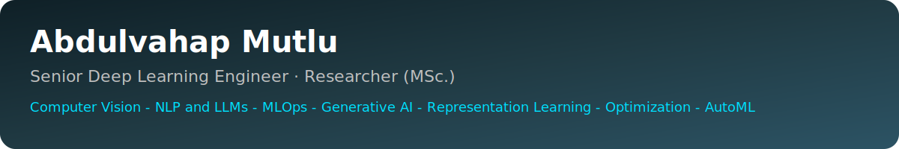
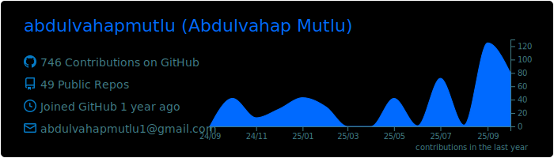
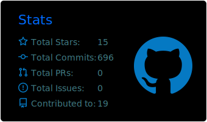
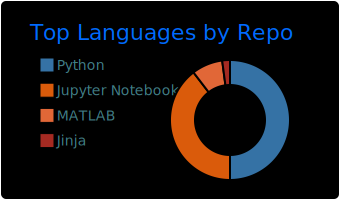
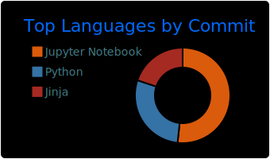
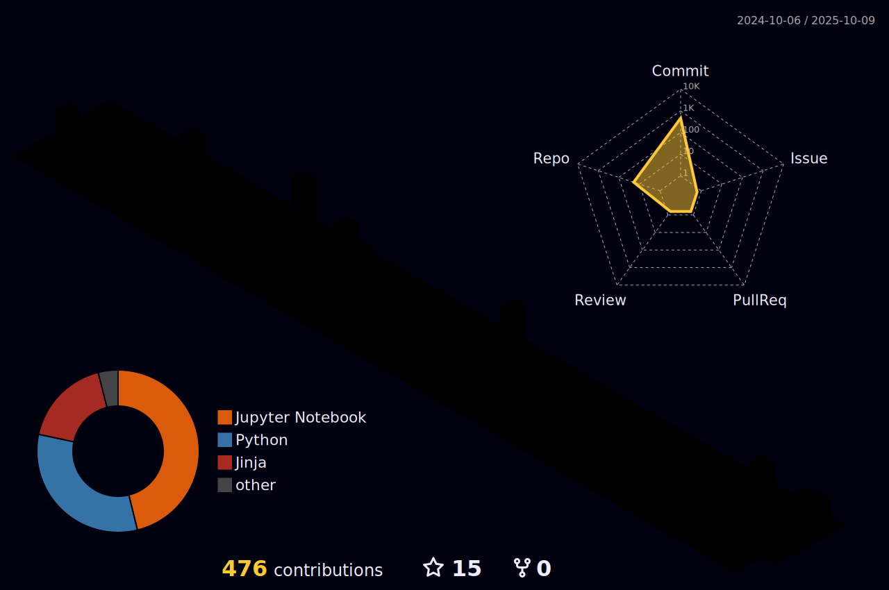

  

<h3 align="left">🚀 Senior Deep Learning Engineer & Researcher (MSc.)</h3>

  
  
  
  

---

## 🔹 About Me

I design and deliver **end-to-end machine learning systems**—from problem framing and data strategy to reliable deployment and lifecycle management. My work blends **applied research** with **production engineering**, emphasizing clarity, scalability, and measurable impact.

I focus on **generalizable capabilities** rather than tool-of-the-month specifics: **Computer Vision**, **NLP & LLMs**, **Biomedical AI**, **Generative AI**, **Representation Learning**, **Optimization & AutoML**, and **MLOps**.  
My approach centers on **reproducibility**, **operational excellence**, and **responsible AI**.

- 🎓 MSc. in progress (Machine Learning / Deep Learning)  
- 🧪 Research orientation with practical delivery across multiple domains  
- 🛠️ Reproducible workflows (configuration, tracking, evaluation, CI/CD, containers)

---

## 🔹 Skills & Tools

<!-- Programming -->

<!-- ML/DL Frameworks -->

<!-- Databases -->

<!-- Cloud -->

<!-- DevOps -->

---

## 🔹 Featured Projects

<table>
<tr>
<td width="50%">

</td>
<td width="50%">

</td>
</tr>

<tr>
<td>

</td>
<td>

</td>
</tr>

<tr>
<td>

</td>
<td>

</td>
</tr>

<tr>
<td colspan="2" align="center">

</td>
</tr>
</table>

---

## 🔹 Publications

- 📄 [ViT-ProtoNet for Few-Shot Image Classification: A Multi-Benchmark Evaluation](https://arxiv.org/abs/2507.09299)  
- 📄 [Synthetic ALS-EEG Data Augmentation for ALS Diagnosis Using Conditional WGAN with Weight Clipping](https://arxiv.org/abs/2506.16243)  
- 📄 [Novel Performance-Based Hyperparameter Optimization with the Use of Bounding Box Tuner (BBT)](https://www.acadlore.com/article/IDA/2025_4_2/ida040204)  
- 📄 [Artificial Intelligence in Electroencephalography: A Comprehensive Survey of Methods, Challenges, and Applications](https://www.acadlore.com/article/ATAIML/2025_4_3/ataiml040304)  

---

## 🔹 Analytics & Insights

<table align="center">
  <tr>
    <td align="center" style="border: none;">
      
    </td>
    <td align="center" style="border: none;">
      
    </td>
  </tr>
  <tr>
    <td align="center" style="border: none;">
      
    </td>
    <td align="center" style="border: none;">
      
    </td>
  </tr>
</table>

  

  

---

## 🔹 Focus Areas & Principles

- **Outcome-oriented**: clear goals, measurable impact  
- **Reproducible by default**: deterministic pipelines, configs, experiment tracking  
- **Operational excellence**: monitoring, CI/CD, resilient systems  
- **Responsible AI**: fairness, safety, privacy-aware design  
- **Simplicity first**: maintainable abstractions, progressive refinement  
- **Collaboration**: docs, reviews, mentorship

---

## 🔹 Get in Touch

📧 [abdulvahapmutlu1@gmail.com](mailto:abdulvahapmutlu1@gmail.com) · 🌐 [abdulvahapmutlu.com](https://www.abdulvahapmutlu.com) · 💼 [LinkedIn](https://www.linkedin.com/in/abdulvahap-mutlu-9420b9235)

  

